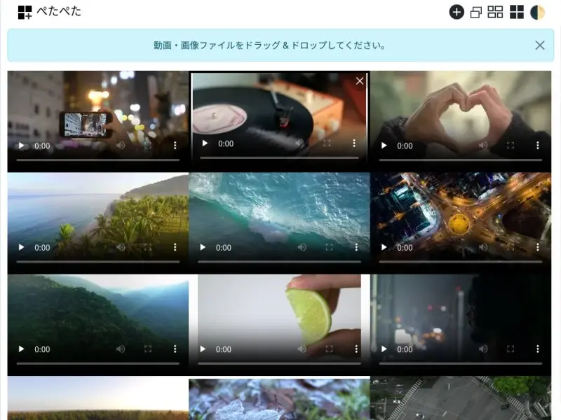
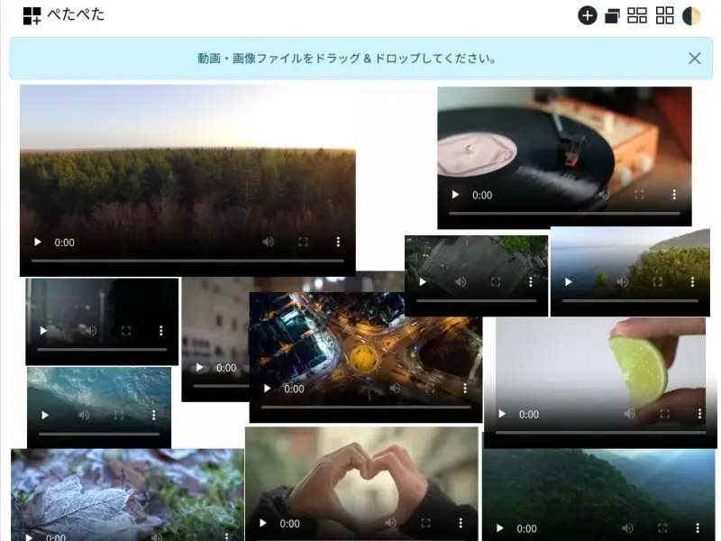

# ぺたぺた

[動画や画像を画面内にぺたぺた貼ることで、たくさんのデータを同時に視聴するためのアプリ](https://marmooo.github.io/petapeta/)です。
画面全体に等間隔で並べたり、サムネイル形式で表示したり、自由配置で表示したり、様々な表示形式に対応しています。

## Screenshots





## Build

```
bash build.sh
```
